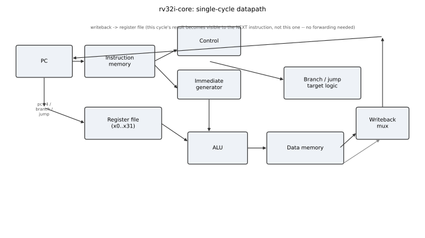
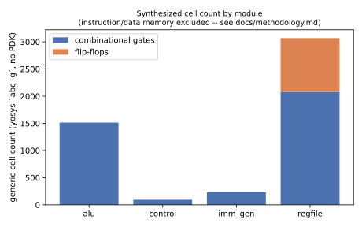

# rv32i-core

A single-cycle RV32I RISC-V CPU, written from scratch in Verilog: full base
integer instruction set, a from-scratch RISC-V assembler (no
`riscv-gnu-toolchain` dependency), 30 directed instruction-level tests plus
two end-to-end test programs checked against independent Python models,
technology-independent logic synthesis with Yosys, and CI that runs all of
it on every push.



## Why this project

The rest of this portfolio is device- and system-level: an [analytical
AlGaN/GaN HEMT model](https://github.com/fatinnihal532-hub/algan-gan-hemt-dse)
extending my BSc thesis, a [patch-antenna synthesis
study](https://github.com/fatinnihal532-hub/microstrip-patch-synthesis), and
several embedded-firmware and power-electronics projects. None of them
touch digital logic design or RTL, which is the other half of what
"semiconductor devices and VLSI" (my stated graduate research interest)
means in practice. This project is that half: a CPU built and verified the
way a small IP block would be, from an instruction-set decode through a
gate-level netlist, with every claim in this README checked in CI rather
than typed in by hand.

## What's implemented

The full RV32I base integer ISA (RISC-V unprivileged spec): every R/I/S/B/U/J
instruction. `FENCE`/`ECALL`/`EBREAK` decode as no-ops (no traps, interrupts
or CSRs in this design -- see Limitations).

| Format | Instructions |
|---|---|
| R-type | `add sub and or xor sll srl sra slt sltu` |
| I-type (arith) | `addi andi ori xori slti sltiu slli srli srai` |
| I-type (load) | `lb lh lw lbu lhu` |
| S-type | `sb sh sw` |
| B-type | `beq bne blt bge bltu bgeu` |
| U-type | `lui auipc` |
| J-type | `jal jalr` |

Single-cycle microarchitecture: fetch, decode, execute, memory access and
writeback all complete in one clock edge, so there are no pipeline hazards
to design around (see `docs/methodology.md` for why that's a deliberate
scope choice, not an oversight).

## Repository layout

```
src/          alu.v  regfile.v  imm_gen.v  control.v  mem.v  core.v
assembler/    tiny_asm.py -- the RV32I subset assembler test programs are written in
programs/     fib.asm, sort.asm
tb/           core_tb_template.v -- filled in per test case by tests/harness.py
tests/        harness.py, test_isa.py (30 cases), test_programs.py
scripts/      synth.tcl (Yosys), report_synth.py, make_figures.py
docs/         methodology.md
verify.py     9 checks against hand-computed / independently modelled results
results/      generated by CI -- see below
```

## Verification

Every check here runs against the actual RTL through Icarus Verilog, not
against a behavioral model of it. `tests/harness.py` assembles a program
with `tiny_asm.py`, generates a testbench, compiles it with the six files in
`src/`, runs it, and reads back the architectural state (registers and the
first 16 data-memory words).

- **30 instruction-level tests** (`tests/test_isa.py`), one per instruction
  or closely related group: every opcode, plus the corner cases that are
  easy to get backwards -- `sub` producing a negative result, `sra`
  sign-extending where `srl` does not, `blt` being signed while `bltu` on
  the same operands is not, `lb`/`lh` sign-extending where `lbu`/`lhu` do
  not, and `jal`/`jalr` linking the correct return address.
- **Two end-to-end programs** (`tests/test_programs.py`, `programs/`): a
  10-step linear recurrence and a 6-element bubble sort, each written in
  RV32I assembly and checked against an independent Python model of the
  same computation -- the check does not re-derive its expected value from
  the assembly, so it cannot pass by construction.
- **`verify.py`** (9 checks): the two program checks above, plus `x0`
  staying zero when written, assembler determinism, an ALU/branch
  spot-check, and a structural check that the synthesized register file has
  exactly 31 x 32 = 992 flip-flops.
- **Verilator `--lint-only`** in CI, as a second, independent front-end's
  opinion on the RTL (Icarus Verilog and Verilator parse/elaborate Verilog
  differently enough that each catches things the other doesn't).

A real bug this caught during development: an early version of the register
file forwarded its write data back onto the read ports for a same-cycle
read of the register just written, on the theory that this was needed for
correctness. It isn't (see `docs/methodology.md`), and it created a genuine
combinational cycle for any instruction whose destination was also a
source, such as `addi t0, t0, -1` in `fib.asm` -- which showed up as the
simulator hanging, not as a wrong answer. The fix was deleting the
forwarding logic.

## Synthesis

`scripts/synth.tcl` runs the register file, ALU, immediate generator and
control unit through Yosys, mapped to generic gates (no foundry cell
library). Instruction/data memory is excluded -- at real size it would be
an SRAM macro, not synthesizable flip-flops -- and `core.v` itself is pure
wiring. See `docs/methodology.md` for exactly what this number does and
does not mean; in short, it's a technology-independent logic-complexity
estimate, **not** a silicon area or clock-frequency claim.



## Reproducibility

```bash
git clone https://github.com/fatinnihal532-hub/rv32i-core.git
cd rv32i-core
sudo apt-get install -y iverilog yosys verilator
pip install -r requirements.txt

python3 -m unittest discover -s tests -v   # 32 tests
verilator --lint-only -Wall src/*.v
yosys -q -s scripts/synth.tcl && python3 scripts/report_synth.py
python3 verify.py                          # 9 checks
python3 scripts/make_figures.py
```

Or run the whole thing in a browser with no local install: [Open in
Colab](https://colab.research.google.com/github/fatinnihal532-hub/rv32i-core/blob/main/run_in_colab.ipynb).

CI (`.github/workflows/ci.yml`) runs all of the above on every push and
regenerates `results/` from that run -- nothing in `results/` is uploaded
by hand.

## Limitations

Stated plainly, because a design is more useful when its edges are marked
rather than left for someone else to discover:

1. **Single-cycle, not pipelined.** No hazards to model, which is the
   point for a first RTL project, but it also means there is no branch
   predictor, no forwarding network, and no CPI to report other than 1.
2. **No M/A/F/D extension, no CSRs, no traps or interrupts.** `ECALL`
   and `EBREAK` are no-ops; there is no privileged mode.
3. **Tiny memories (2 KiB instruction / 1 KiB data by default),** sized for
   fast test-suite compile times (see `docs/methodology.md`), not
   representative of any target system.
4. **No real PDK.** The gate counts are technology-independent; there is
   no area, power or timing number anywhere in this repository, because
   producing one honestly needs a real standard-cell library this flow
   does not have.
5. **The assembler is intentionally minimal** (`assembler/tiny_asm.py`):
   it supports exactly what the test programs need, not general RISC-V
   assembly (no macros, no relocations, `li` limited to a single `addi`'s
   12-bit range). It exists so test programs are readable source rather
   than a prebuilt binary, not to replace a real toolchain.

## Future work

1. Add the SkyWater 130nm open PDK and an OpenROAD place-and-route flow to
   get real area, power and static timing, replacing the generic gate
   count with actual numbers and a critical-path report.
2. Pipeline the design (classic 5-stage: IF/ID/EX/MEM/WB) and add the
   forwarding and hazard-detection logic the single-cycle version
   deliberately avoids, with a directed hazard test suite.
3. Add a minimal CSR file and trap handling (`mret`, `ecall` as a real
   trap) so the core can run a small RTOS or the `riscv-tests` machine-mode
   compliance suite directly, rather than only hand-written programs.

## Citation

See `CITATION.cff`.
